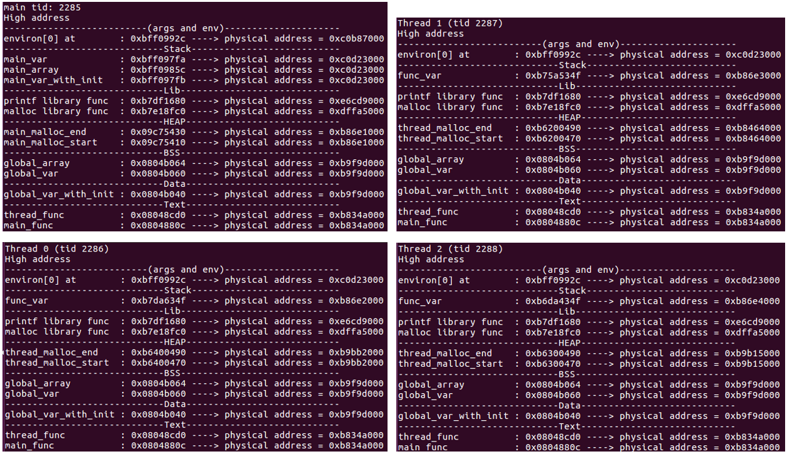
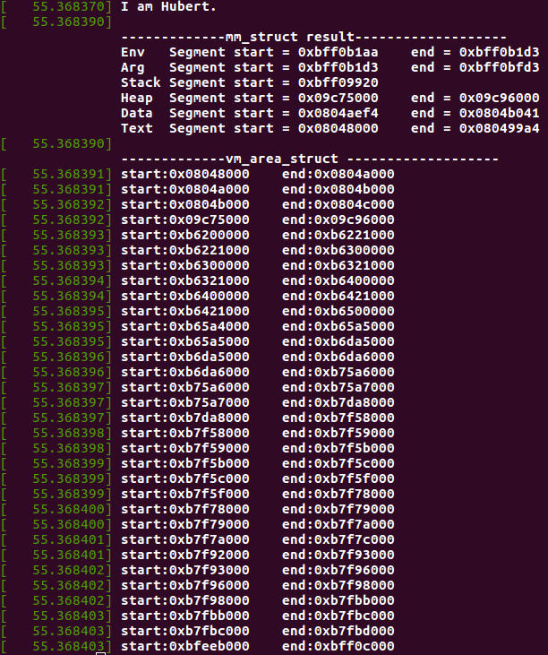

# Linux Memory Layout of Multithread Application
## Kernel and OS version
### 32bit
Linux Distribution: Ubuntu 16.04.6  
Kernel version    : 4.15
### 64bit
Linux Distribution: Ubuntu 20.04.5  
Kernel version    : 5.15

## How to use
### Step 1. git clone 這個專案
```
git clone https://github.com/Szu-Chi/Linux-Memory-Layout-of-Multithread-Application.git
```

### Step 2. 設定系統環境與編譯kernel  
32bit
```
sudo sh 32bit_env_setup.sh
```
64bit
```
sudo sh 64bit_env_setup.sh
```

### Step3. 重新開機
```
reboot
```

### Step4. 執行multi-thread程式
32bit
```
sh run_c.sh 32bit/32bit_multi_thread_memory_layout
```
64bit
```
sh run_c.sh 64bit/64bit_multi_thread_memory_layout
```
### Step5. 使用dmesg查看system call執行結果
```
dmesg
```

## Result
### 32bit
  
  

### 64bit
  
  


## Demo 
**32bit vedio link:** https://youtu.be/tE5-ElN0wXg